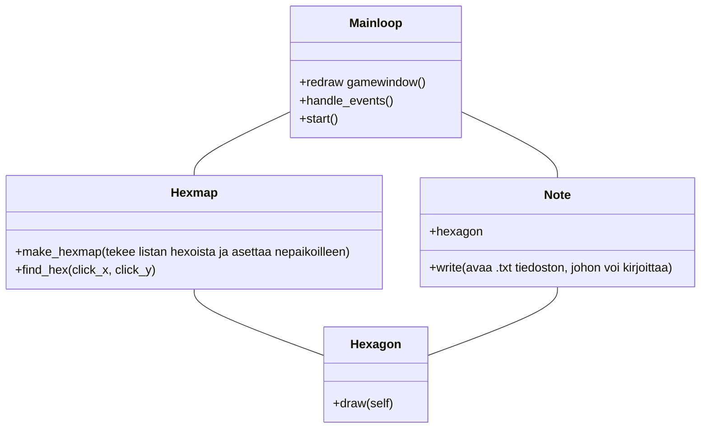

Arkkitehtuurikuvaus:

Ohjelmassa Pääluokat ovat Mainloop, Hexmap, Hexagon, MonsterNote, Statblock, Dropdown ja Note.

Hexagon luokka määrittelee ja piirtää kartassa tarvittavat kuusikulmiot.

Hexmap luo näistä kuusikulmio olioista ruudukon ja vastaa siitä että on tiedossa, mitä ruutua hiirellä osoitetaan tai klikataan.

Note luokka vastaa muistiinpanojen kirjoittamisesta kutakin ruutua vastaavaan tiedostoon.

MonsterNote vastaa csv tiedoston tekemisestä, johon tallennetaan hexaan liittyvät monsterit.

Statblock vastaa kuvista tehtävien Sprite olioiden tekemisestä.

Dropdown vastaa valikon tekemisestä, josta valitaan monsut monsternotesiin josta ne haetaan statblockeiksi.

Mainloop vastaa ohjelman pääsilmukan toiminnasta, tapahtumien käsittelystä  ja ruudun päivittämisestä.


## Toiminta

Main komentaa Hexmappia tekemään tietyn kokoisen hexmapin. 

Hexmap lisää listaan n Hexagon oliota.

Main luo MainLoop olion joka startatessaan pyytää Hexagoneja piirtymään omille paikoilleen peli-ikkunan päälle.


```mermaid
sequenceDiagram

participant Main
participant MainLoop
participant Hexmap
participant Hexagon
participant Note

Main->>Hexmap: make n size hexmap
Hexmap->>Hexagon: hexmap.hexlist.append(n x hexagon)
Hexagon->>Hexmap: n x Hexagons
Hexmap->>Main: hexmap
Main->>MainLoop: hexmap, clock, event_queue, win, picture

Main->>MainLoop: start
MainLoop->>Hexagon:for i in hexmap.hexlist -> draw
Hexagon->>MainLoop: 
