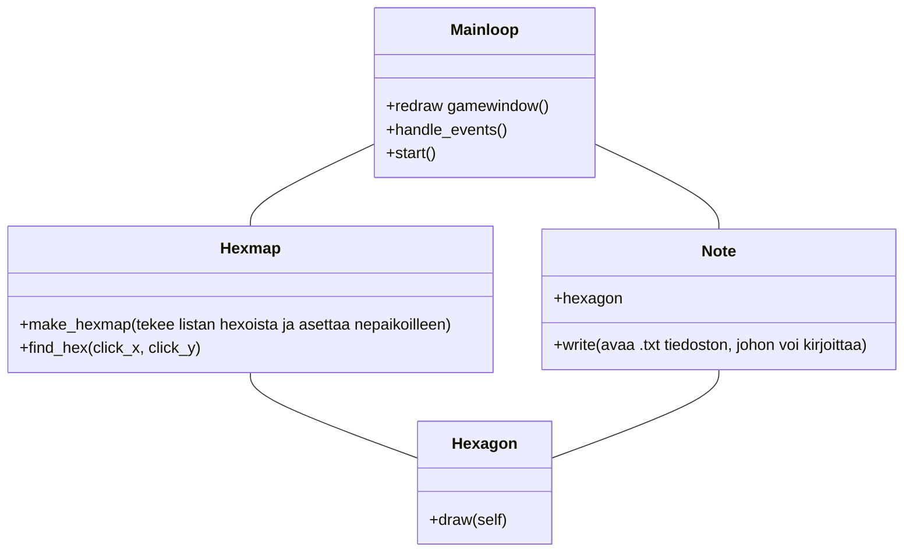

```mermaid
sequenceDiagram

participant Main
participant MainLoop
participant Hexmap
participant Hexagon
participant Note

Main->>Hexmap: make n size hexmap
Hexmap->>Hexagon: hexmap.hexlist.append(n x hexagon)
Hexagon->>Hexmap: n x Hexagons
Hexmap->>Main: hexmap
Main->>MainLoop: hexmap, clock, event_queue, win, picture

Main->>MainLoop: start
MainLoop->>Hexagon:for i in hexmap.hexlist -> draw
Hexagon->>MainLoop: 
